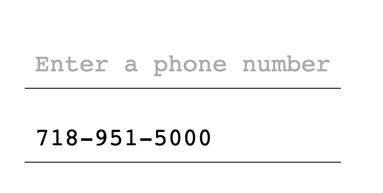

## Objective

The objective is to create an input mask that formats telephone numbers in real-time.

It should present a user entered phone number xxxxxxxx as something like xxx-xxx-xxxx. Note: Choosing the `-` here as it is slightly easier to implement than with `()` characters for `(XXX) XXX - XXXX`. We will assume US phone numbers to keep it simple. The presented example uses Brooklyn College's phone number, `718-951-5000`

The user will be entering in 1 key at a time.

When 3 characters have been entered, a `-` should append the input to yield `XXX-`.

When 6 characters have been entered, a `-` should append the input again to yield `XXX-XXX-`

And finally after 10 characters have been entered, it should not accept any further input.

## References - Official specification documents

These are provided as helpful points of reference. You may search for other materials.

- (CSS) CSS Properties https://www.w3.org/TR/CSS/#properties
- (JS) Keyboard Events https://www.w3.org/TR/uievents/#events-keyboardevents

---Good Job!---
